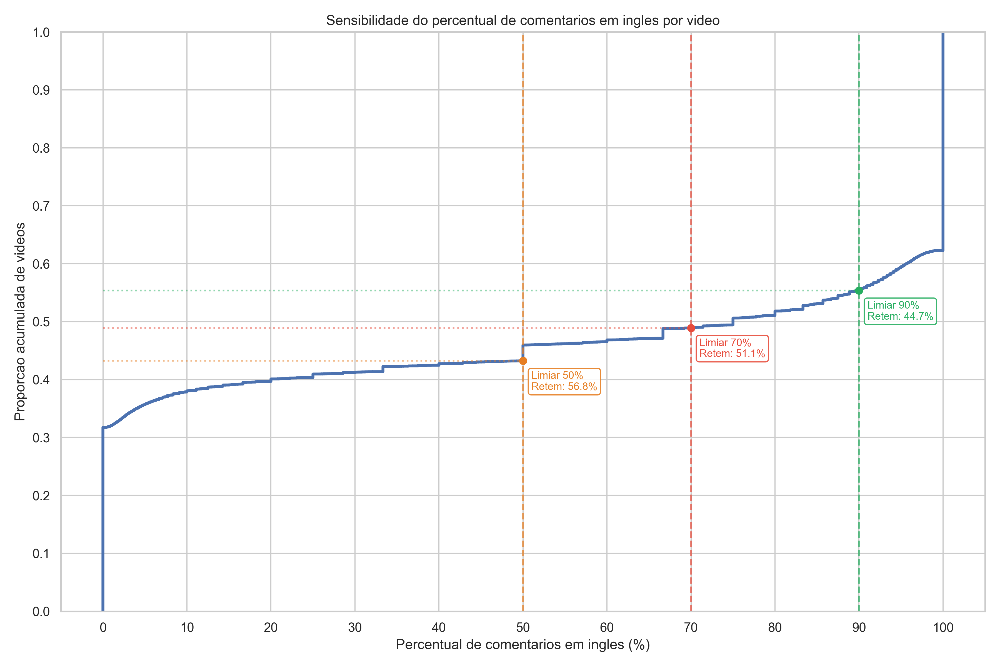
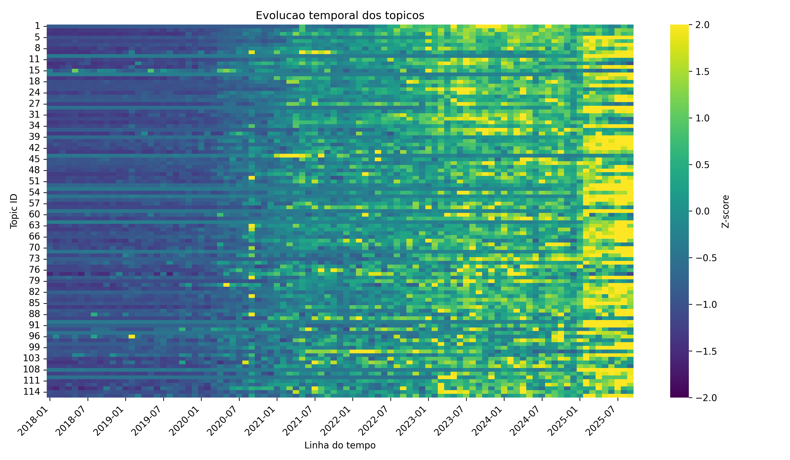
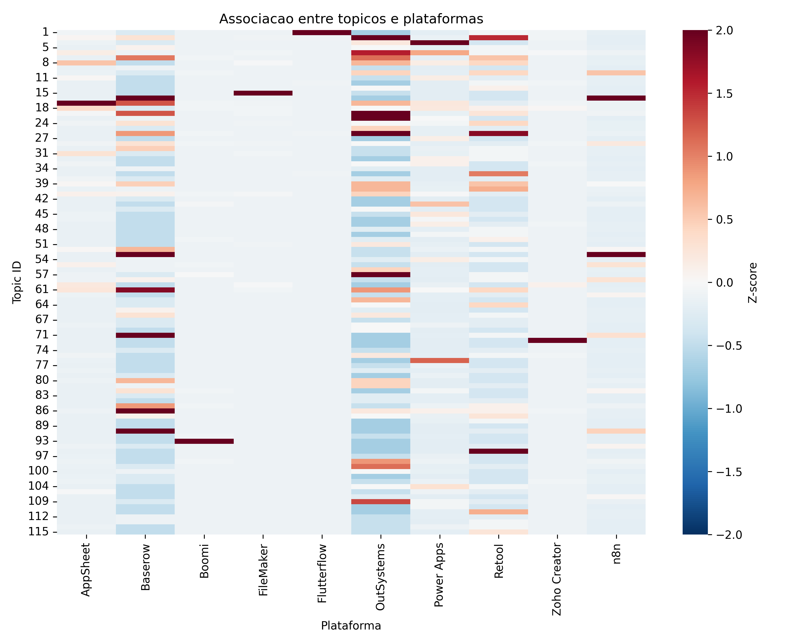
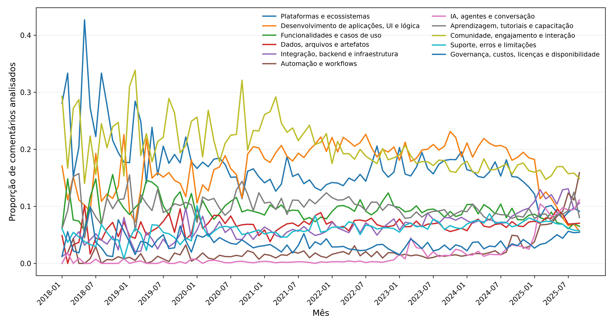

# Low-Code/No-Code YouTube Comments Research Pipeline

[](https://www.python.org/)
[](LICENSE)
[]()

> **English** | [Português](#português)

---

## Overview

This repository contains the full data processing and analysis pipeline for a master's research study on the **discourse community around low-code and no-code (LCNC) development platforms** on YouTube.

Using a corpus of **260,791 English-language YouTube comments** across **16,019 videos** and **4,852 channels** collected between 2018 and 2025, the study addresses three research questions:

| RQ | Question |
|----|---------|
| **RQ1** | What are the scale, temporal distribution, public interaction, and platform coverage of the retrieved video-centered corpus in low-code ecosystems? |
| **RQ2** | What software engineering and learning concerns are represented in the video-centered corpus and how are they distributed across development activities? |
| **RQ3** | How does the composition of these concerns change over the observation window and what does this trajectory indicate about the boundary of low-code ecosystems in public discussion? |

The pipeline spans **five stages**: raw data ingestion → thematic filtering → language detection → topic modelling (BERTopic) → corpus characterisation.

---

## Repository Structure

```
github_repo/
│
├── README.md                          ← This file
├── .gitignore
├── requirements.txt
│
├── pipeline_00_config.py              ← Shared paths, constants, utilities
├── pipeline_01_executar.py            ← Pipeline runner (all or partial stages)
│
├── 02_filtragem_tematica/
│   └── etapa_01_filtrar_tematica.py   ← Stage 02: thematic filtering
│
├── 03_idioma/
│   ├── etapa_02_detectar_idioma.py    ← Stage 03a: 3-tool language detection
│   ├── etapa_03_analisar_limiar.py    ← Stage 03b: threshold sensitivity
│   └── etapa_04_filtrar_corpus_ingles.py  ← Stage 03c: English corpus
│
├── 04_topicos/
│   ├── etapa_05_preparar_base_topicos.py  ← Stage 04a: clean comment base
│   ├── etapa_06_alinhar_topicos_legado.py ← Stage 04b: align BERTopic output
│   ├── etapa_07_analisar_topicos.py       ← Stage 04c: temporal + platform analysis
│   ├── etapa_08_analisar_macrotemas.py    ← Stage 04d: macro-theme aggregation
│   └── gerar_tabelas_latex_topicos.py     ← Generate LaTeX topic tables
│
├── 05_caracterizacao_corpus/
│   └── etapa_09_caracterizar_corpus.py    ← Stage 05: corpus metrics
│
├── figures/                               ← Publication-ready figures
│   ├── fig01_sensibilidade_limiar_idioma.png
│   ├── fig02_metricas_corpus.pdf
│   ├── fig03_heatmap_top30_plataformas.pdf
│   ├── fig04_evolucao_temporal_topicos.pdf
│   ├── fig05_heatmap_plataformas_topicos.pdf
│   └── fig06_evolucao_macrotemas.pdf
│
├── reports/                               ← Plaintext analysis reports
│   ├── 01_filtragem_tematica.txt
│   ├── 02_comparacao_idioma.txt
│   ├── 03_sensibilidade_limiar.txt
│   ├── 04_filtragem_corpus_ingles.txt
│   ├── 05_cobertura_topicos.txt
│   ├── 06_analise_topicos.txt
│   ├── 07_macrotemas.txt
│   └── 08_caracterizacao_corpus.txt
│
└── docs/
    ├── pipeline_overview.md           ← Detailed stage-by-stage guide
    └── research_questions.md         ← RQ methodology
```

---

## Key Results

### Corpus

| Metric | Value |
|--------|-------|
| Study period | Jan 2018 – Sep 2025 |
| Videos | 16,019 |
| Channels | 4,852 |
| Comments (analytical period) | 260,791 |
| Unique commenters | 118,744 |
| Total views | 196,604,871 |

### Top LCNC Platforms (by video count)

Power Apps · FileMaker · FlutterFlow · Bubble.io · AppSheet · n8n · Dynamics 365 · Boomi · Retool · OutSystems

### Topic Macro-Themes (RQ2)

| Macro-theme | Topics | Comments | Share |
|-------------|--------|----------|-------|
| Community, engagement & interaction | 18 | 33,272 | 18.4% |
| App dev, UI & logic | 16 | 30,627 | 17.0% |
| Platforms & ecosystems | 12 | 26,140 | 14.5% |
| Learning, tutorials & training | 10 | 16,985 | 9.4% |
| Features & use cases | 11 | 15,894 | 8.8% |
| Integration, backend & infrastructure | 11 | 14,417 | 8.0% |
| Support, errors & limitations | 4 | 11,752 | 6.5% |
| Data, files & artifacts | 7 | 12,561 | 7.0% |
| Automation & workflows | 4 | 6,732 | 3.7% |
| Governance, cost & licensing | 5 | 6,252 | 3.5% |
| AI, agents & conversation | 3 | 5,957 | 3.3% |

---

## Figures

| Figure | Description |
|--------|-------------|
|  | **Fig 1** — CDF of % English comments per video, with threshold sensitivity analysis at 50%, 70%, and 90%. |
| **Fig 2** `figures/fig02_metricas_corpus.pdf` | Six-panel time series: videos, channels, comments, views, likes, unique users (monthly, 2018–2025). |
| **Fig 3** `figures/fig03_heatmap_top30_plataformas.pdf` | Z-score heatmap of quarterly video mentions for the top-30 LCNC platforms. |
|  | **Fig 4** — Z-score heatmap of monthly comment volume per topic ID (temporal analysis). |
|  | **Fig 5** — Z-score heatmap of platform × topic co-occurrence. |
|  | **Fig 6** — Proportion of comments per macro-theme over time (monthly, 2018–2025). |

---

## Reproducing the Analysis

### 1. Clone this Repository

```bash
git clone https://github.com/<your-username>/<repo-name>.git
cd <repo-name>
```

### 2. Create a Python Environment

```bash
python -m venv .venv

# Linux / macOS
source .venv/bin/activate

# Windows (PowerShell)
.\.venv\Scripts\Activate.ps1
```

### 3. Install Dependencies

```bash
pip install -r requirements.txt
```

> **Note on fasttext**: On Windows, install using the unofficial wheel:
> ```
> pip install fasttext-wheel
> ```
> On Linux/macOS:
> ```
> pip install fasttext
> ```

### 4. Download the FastText Language Model

The language detection step requires Meta's `lid.176.bin` model (~125 MB, publicly available).

```bash
# Linux / macOS
wget https://dl.fbaipublicfiles.com/fasttext/supervised-models/lid.176.bin \
     -O 03_idioma/01_modelo_fasttext_lid176.bin

# Windows (PowerShell)
Invoke-WebRequest `
    -Uri "https://dl.fbaipublicfiles.com/fasttext/supervised-models/lid.176.bin" `
    -OutFile "03_idioma\01_modelo_fasttext_lid176.bin"
```

### 5. Provide Raw Data

Place your raw YouTube data files in `01_entrada_bruta/`:

```
01_entrada_bruta/
├── 01_videos_youtube_brutos.csv
└── 02_comentarios_youtube_brutos.csv
```

See [Data Availability](#data-availability) below for column specifications and how to collect your own data using the YouTube Data API v3.

### 6. Run the Pipeline

**All stages:**
```bash
python pipeline_01_executar.py
```

**Partial run (e.g., stages 1–4 only):**
```bash
python pipeline_01_executar.py --from-stage 01 --to-stage 04
```

**Individual stage:**
```bash
python 02_filtragem_tematica/etapa_01_filtrar_tematica.py
```

> For detailed instructions on each stage, see [`docs/pipeline_overview.md`](docs/pipeline_overview.md).

### 7. Run the BERTopic Step (Stage 04 prerequisite)

The BERTopic modelling step was run externally and is not included in the automated pipeline (it requires GPU resources and significant memory for large corpora). See [`docs/pipeline_overview.md#reproducing-bertopic`](docs/pipeline_overview.md#reproducing-bertopic) for instructions on reproducing this step.

### 8. Inspect Results

After running the pipeline:
- **Figures** are saved to their respective stage directories and also in `figures/`.
- **Reports** are in `reports/`.
- **LaTeX tables** are generated by `04_topicos/gerar_tabelas_latex_topicos.py`.

---

## Data Availability

> **The full raw text comments are NOT included in this repository** due to YouTube's Terms of Service. Comment-level text data cannot be redistributed publicly. 
> Instead, we provide the IDs and metadata for reproducibility.

### Provided ID Datasets

In the `01_entrada_bruta/` directory, you will find:
- **`01_videos_youtube_ids.csv`**: Contains video metadata (IDs, views, dates) without titles or descriptions.
- **`02_comentarios_youtube_ids.csv`**: Contains comment IDs, video IDs, channel IDs, and timestamps, **without the `comment` or `author` text**.

### Hydrating the Data (Reproducibility)

To run stages 02, 03, and 04 of the pipeline (which require text analysis), you must rehydrate the comments using the provided IDs and the YouTube Data API:

1. Use the `02_comentarios_youtube_ids.csv` file.
2. Query the YouTube Data API `comments` endpoint by `id` to retrieve the original text for each comment.
3. Reconstruct the `02_comentarios_youtube_brutos.csv` following the expected schema below.

### Pre-calculated Stages (Direct Analysis)

If you wish to bypass text rehydration and the heavy NLP modeling (BERTopic), you can use the pre-calculated ID mappings provided in the repository to directly reproduce the paper's charts and statistical analyses:
- **`04_topicos/02_comentarios_com_topicos_ids.csv`**: Maps each `comment_id` to its calculated `topic_id` and `published_at` date.

*Note: For stages 05 and onwards, pre-calculated outputs (e.g., topic assignments) are provided in the repository so you can reproduce the statistical analysis and charts without needing to rehydrate the text data.*

### Expected Rehydrated Input Schema

**`01_videos_youtube_brutos.csv`** — one row per video:

| Column | Type | Description |
|--------|------|-------------|
| `video_id` | string | YouTube video ID |
| `channel_id` | string | YouTube channel ID |
| `title` | string | Video title |
| `description` | string | Video description |
| `published_at` | datetime (UTC) | Publication timestamp |
| `view_count` | integer | View count at collection time |
| ... | | Additional YouTube API metadata fields |

**`02_comentarios_youtube_brutos.csv`** — one row per comment:

| Column | Type | Description |
|--------|------|-------------|
| `video_id` | string | Parent video ID |
| `comment_id` | string | Unique comment ID |
| `author` | string | Display name |
| `author_channel_id` | string | Commenter channel ID |
| `comment` | string | Comment text |
| `published_at` | datetime (UTC) | Comment timestamp |
| `like_count` | integer | Likes on comment |
| `is_reply` | boolean | Whether this is a reply |
| `parent_id` | string | Parent comment ID (if reply) |
| ... | | Additional YouTube API metadata |

### Requesting Access

To request access to any further processed (anonymised) data for academic purposes, please contact the corresponding author via the paper's institutional contact.

---

## Citation

If you use this pipeline or data in your research, please cite:

```bibtex
@article{AUTHOR_YEAR,
  title   = {Title of the Paper},
  author  = {Author, Welyson and Co-Author, Name},
  journal = {Information and Software Technology},
  year    = {2025},
  doi     = {10.XXXX/XXXXXXX}
}
```

*(Update with actual DOI upon publication.)*

---

## License

This code is released under the **MIT License**. See [LICENSE](LICENSE) for details.

Data files are subject to YouTube's Terms of Service and are not redistributed here.

---

## Contact

For questions about the research methodology, annotation protocol, or pipeline, please open a GitHub Issue or contact the corresponding author via the published paper.

---
---

<a name="português"></a>
## Português

> **[English](#overview)** | **Português**

---

## Visão Geral

Este repositório contém o pipeline completo de processamento e análise de dados de uma pesquisa de mestrado sobre a **comunidade de discurso em torno das plataformas low-code e no-code (LCNC) no YouTube**.

Utilizando um corpus de **260.791 comentários em inglês** em **16.019 vídeos** de **4.852 canais**, coletados entre 2018 e 2025, o estudo endereça três questões de pesquisa:

| QP | Questão |
|----|---------|
| **QP1** | Qual é a escala, distribuição temporal, interação pública e cobertura de plataforma do corpus centrado em vídeo recuperado nos ecossistemas low-code? |
| **QP2** | Quais preocupações de engenharia de software e aprendizado estão representadas no corpus centrado em vídeo e como elas são distribuídas pelas atividades de desenvolvimento? |
| **QP3** | Como a composição dessas preocupações muda ao longo da janela de observação e o que essa trajetória indica sobre os limites dos ecossistemas low-code na discussão pública? |

---

## Como Reproduzir

### Pré-requisitos

1. **Python ≥ 3.10**
2. Instalar dependências:
   ```bash
   pip install -r requirements.txt
   ```
   > No Windows, use `pip install fasttext-wheel` no lugar de `fasttext`.

3. Baixar o modelo FastText:
   ```powershell
   Invoke-WebRequest `
       -Uri "https://dl.fbaipublicfiles.com/fasttext/supervised-models/lid.176.bin" `
       -OutFile "03_idioma\01_modelo_fasttext_lid176.bin"
   ```

4. Colocar os dados brutos em `01_entrada_bruta/`:
   - `01_videos_youtube_brutos.csv`
   - `02_comentarios_youtube_brutos.csv`

### Executar o Pipeline Completo

```bash
python pipeline_01_executar.py
```

### Executar Etapas Específicas

```bash
python pipeline_01_executar.py --from-stage 01 --to-stage 04
```

### Executar uma Etapa Individual

```bash
python 02_filtragem_tematica/etapa_01_filtrar_tematica.py
```

---

## Estrutura do Pipeline

O pipeline tem 5 estágios principais:

| Etapa | Descrição | Script principal |
|-------|-----------|-----------------|
| 01 | Dados brutos (coleta via YouTube API) | *(coleta externa)* |
| 02 | Filtragem temática (termos LCNC) | `etapa_01_filtrar_tematica.py` |
| 03 | Detecção de idioma (ensemble fastText + langdetect + langid) | `etapa_02–04_*.py` |
| 04 | Análise de tópicos (BERTopic + macrotemas) | `etapa_05–08_*.py` |
| 05 | Caracterização do corpus | `etapa_09_caracterizar_corpus.py` |

Para detalhes completos, veja [`docs/pipeline_overview.md`](docs/pipeline_overview.md).

---

## Disponibilidade dos Dados

> **Os textos brutos completos não estão incluídos** neste repositório devido aos Termos de Serviço do YouTube. No entanto, fornecemos os metadados e os IDs.

### Arquivos de IDs Disponibilizados

Na pasta `01_entrada_bruta/`, você encontrará:
- **`01_videos_youtube_ids.csv`**: Metadados de vídeos (IDs, visualizações) sem títulos ou descrições.
- **`02_comentarios_youtube_ids.csv`**: IDs de comentários, vídeos, canais e timestamps, **sem os textos (`comment`) ou nomes (`author`)**.

### Reidratando os Dados (Reprodutibilidade)

Para executar as etapas 02, 03 e 04, você precisará reidratar os comentários usando a API do YouTube:
1. Utilize o arquivo `02_comentarios_youtube_ids.csv`.
2. Busque na API do YouTube (`comments`) os textos correspondentes a cada `id`.
3. Recrie o arquivo original `02_comentarios_youtube_brutos.csv` conforme o esquema esperado.

### Etapas Pré-Calculadas (Análise Direta)

Caso você queira pular a reidratação de texto e a modelagem pesada (BERTopic), você pode usar os mapeamentos pré-calculados fornecidos no repositório para reproduzir diretamente os gráficos e análises estatísticas do artigo:
- **`04_topicos/02_comentarios_com_topicos_ids.csv`**: Mapeia cada `comment_id` ao seu `topic_id` calculado e data de publicação.

*Nota: Para as etapas 05 em diante, os resultados pré-calculados (tópicos) estão disponíveis nas respectivas pastas para que a análise estatística seja possível sem reidratar o texto.*

Para solicitar acesso aos dados adicionais anonimizados para fins acadêmicos, entre em contato com o autor correspondente via o artigo publicado.

---

## Citação

```bibtex
@article{AUTOR_ANO,
  title   = {Título do Artigo},
  author  = {Autor, Welyson and Coautor, Nome},
  journal = {Information and Software Technology},
  year    = {2025},
  doi     = {10.XXXX/XXXXXXX}
}
```

*(Atualizar com o DOI real após a publicação.)*
